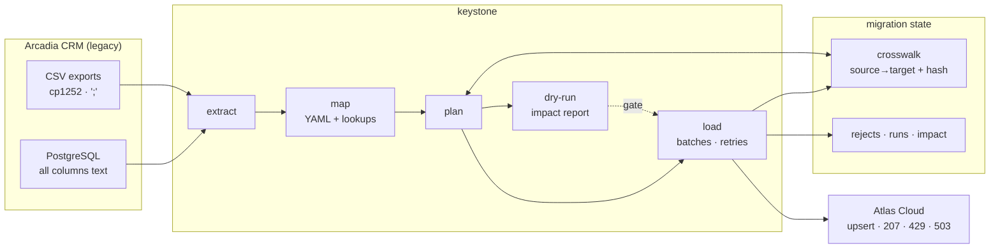

# CRM Data Migration Toolkit

[](https://github.com/legend-cell05/crm-erp-data-migration/actions/workflows/ci.yml)
[](https://www.python.org/)
[](https://www.postgresql.org/)
[](https://fastapi.tiangolo.com/)
[](https://docs.docker.com/compose/)
[](https://docs.astral.sh/ruff/)
[](https://mypy-lang.org/)
[](LICENSE)

Migrating a twenty-year-old CRM into a Dataverse-style cloud platform, with the
rules written in YAML rather than buried in code, a **dry-run that has to
happen before anything is written**, and a crosswalk that makes a second run an
update instead of a duplicate.

> ### ⚠️ Synthetic data
>
> **Arcadia CRM and Atlas Cloud do not exist.** Every company, contact,
> opportunity and activity in this project is generated by the code in this
> repository — including, on purpose, 3 063 data-quality defects. Nothing here
> describes a real business, and the project has never been deployed.

---

## Table of contents

1. [The problem](#the-problem)
2. [Objectives](#objectives)
3. [Features](#features)
4. [Architecture](#architecture)
5. [Tech stack](#tech-stack)
6. [Project structure](#project-structure)
7. [Installation](#installation)
8. [Configuration](#configuration)
9. [Database setup](#database-setup)
10. [Usage](#usage)
11. [The mapping language](#the-mapping-language)
12. [The dry-run](#the-dry-run)
13. [The data model](#the-data-model)
14. [Idempotency](#idempotency)
15. [Testing](#testing)
16. [Docker](#docker)
17. [CI/CD](#cicd)
18. [Results](#results)
19. [Limitations](#limitations)
20. [Future improvements](#future-improvements)
21. [Security considerations](#security-considerations)
22. [Author](#author)

---

## The problem

A company is replacing Arcadia, its on-premise CRM from 2011, with Atlas Cloud.
Twenty years of customer data has to move: 1 284 companies, 4 000 contacts,
2 600 opportunities and 9 000 logged activities.

The data is what twenty years of data entry looks like. Every column is text,
including amounts and dates. The same company is in the system three times
under three spellings. Countries are written six ways, one of them a typo.
Amounts read `12 500,00`, `$ 12,500.00` and `n/c`. Some contacts point at
companies that no longer exist. Activities are not even in the database — they
are in a nightly CSV export, semicolon-separated, encoded cp1252.

And a migration has one property that makes it unlike anything else:

> **You find out whether it worked after it is too late to decide not to do it.**

The target is the system of record from Monday. The old one is off. The 412
records that quietly became `NULL` are discovered in March.

So this project is built around one question — *what would happen if I ran
this?* — asked and answered before anything is written.

## Objectives

- Put the transformation rules where the **business can read them**: versioned
  YAML, not Python.
- Make a **dry-run mandatory**, and make the approval refer to the exact
  content of the mapping rather than to a version number.
- Be **idempotent**: a second run must write nothing, and prove it.
- Survive a real API: batch limits, rate limits, partial failures, outages.
- Reject records **with a cause**, not a count.
- Prove the result afterwards by comparing three independent systems.

## Features

**The declarative layer**

- 19 transformations and 10 validation rules in a **closed registry** — a
  mapping names a function, it cannot define one.
- 7 lookup tables as CSV, owned by whoever owns the data.
- Per-field policy on failure: `reject`, `default`, `null` or `passthrough`.
- A **fingerprint** over every mapping file and lookup table, so editing one
  invalidates its approval automatically.

**The dry-run**

- Runs the **same code path** as the load, with the last stage not called.
- Projects references forward, so a first run does not predict that every
  contact will be rejected.
- Impact report in Markdown and JSON: what would be created, updated, skipped,
  rejected — and **why**, ordered by how many records each cause accounts for.
- Source profiling: emptiness, cardinality and examples for every column a rule
  depends on.

**The load**

- A gate that refuses to start without a matching dry-run (exit code **3**).
- Batched upserts on an alternate key, in dependency order.
- Per-record results read from a 207 response, not a status code.
- Exponential backoff with **full jitter**, `Retry-After` obeyed, transient
  errors only.
- A **crosswalk** written per batch, so a run killed halfway is resumable.

**Afterwards**

- Rejections with stage, field, rule, message and payload; attempts counted;
  `ABANDONED` after a threshold.
- Reconciliation across source, crosswalk and target — including a sum of the
  money, because a row count survives a mangled decimal separator.
- 19 CLI commands, one per operation.

## Architecture



The boundary that matters is between **map** and **load**: everything up to and
including planning is pure — same inputs, same outputs, no network. That is
what makes the dry-run trustworthy. It is not a mode; it is the same code with
the last stage not called.

Full diagrams and the performance numbers: [docs/architecture.md](docs/architecture.md).

## Tech stack

| Layer | Choice | Why |
| --- | --- | --- |
| Language | Python 3.11 / 3.12 | Typed throughout; `mypy --disallow-untyped-defs` |
| Database | PostgreSQL 16 | Legacy source and migration state, in separate schemas |
| DB access | SQLAlchemy 2.0 Core + psycopg 3 | Bound parameters everywhere |
| Mapping | PyYAML + Pydantic v2 | The schema of a mapping file is enforced, so a typo is an error |
| Target | FastAPI + Uvicorn | Real HTTP, real batch limits, real 429s |
| HTTP client | httpx | Timeouts, connection pooling, mockable transport |
| CLI | Typer + Rich | One command per operation |
| Tests | pytest | 153 tests, 138 unit + 15 integration |
| Quality | Ruff, mypy | Both clean, enforced in CI |
| Container | Docker multi-stage | Non-root UID 10001, asserted in CI |

No ETL framework. 16 000 records do not need one, and adding one would hide the
three things this project is actually about: the mapping language, the gate and
the crosswalk.

## Project structure

```
crm-erp-data-migration/
├── mappings/                  # THE INTERESTING PART — read this first
│   ├── account.yaml           # 17 fields, 4 validations
│   ├── contact.yaml           # depends_on: [account]
│   ├── opportunity.yaml       # depends_on: [account, contact]
│   ├── activity.yaml          # source: cp1252 CSV
│   └── lookups/               # 7 translation tables, owned by the business
├── src/keystone/
│   ├── mapping/               # schema, registries, loader, engine
│   ├── extract/               # SQL and CSV readers
│   ├── dryrun/                # profiling, projection, impact report, gate
│   ├── load/                  # client, retry, batching, crosswalk, rejects
│   ├── reconcile/             # source vs crosswalk vs target
│   ├── target/                # the simulated Atlas Cloud (FastAPI)
│   ├── generation/            # the simulated Arcadia CRM, with its defects
│   ├── pipeline.py            # one function per operation
│   └── cli.py                 # 19 commands
├── sql/schema/                # legacy source + migration state
├── tests/{unit,integration}/
├── docs/                      # architecture · mapping · dry-run · data-model
│                              # · operations · decisions · security
├── .github/workflows/ci.yml   # lint · mappings · test · migration · docker
├── docker-compose.yml         # postgres + atlas + keystone
├── Dockerfile
└── .env.example
```

## Installation

**Prerequisites**: Python 3.11+, PostgreSQL 16 (or Docker).

```bash
git clone https://github.com/legend-cell05/crm-erp-data-migration.git
cd crm-erp-data-migration

python -m venv .venv
source .venv/bin/activate          # Windows: .venv\Scripts\activate
pip install -e ".[dev]"

cp .env.example .env               # then edit it
```

Or, with Docker and nothing else:

```bash
cp .env.example .env
docker compose up --build
```

## Configuration

Everything is an environment variable prefixed `KEYSTONE_`, read from `.env`.
`.env` is git-ignored; `.env.example` is the documented template. The settings
worth knowing:

| Variable | Default | What it controls |
| --- | --- | --- |
| `KEYSTONE_DB_*` | localhost/keystone | Connection. The password is a `SecretStr` and never reaches a log |
| `KEYSTONE_TARGET_BASE_URL` | `http://localhost:8080` | The target. In Compose: `http://atlas:8080` |
| `KEYSTONE_TARGET_API_KEY` | placeholder | Sent as `X-API-Key`; also a `SecretStr` |
| `KEYSTONE_BATCH_SIZE` | 200 | Records per batch. The target refuses anything above 250 |
| `KEYSTONE_MAX_REJECT_RATE_PCT` | 5.0 | **The gate.** A load refuses to start above this |
| `KEYSTONE_MAX_RETRY_ATTEMPTS` | 3 | Reject replays before a record is `ABANDONED` |
| `KEYSTONE_RETRY_MAX_ATTEMPTS` | 5 | HTTP retry budget per request |
| `KEYSTONE_TARGET_FAULT_RATE` | 0.05 | Share of batches the target fails on purpose |
| `KEYSTONE_TARGET_RATE_LIMIT_RATE` | 0.06 | Share rate-limited with `Retry-After` |
| `KEYSTONE_RANDOM_SEED` | 20260220 | Makes the generated legacy CRM reproducible |

Schema names are validated against `[a-z_][a-z0-9_]*` at start-up, so a hostile
value fails before a connection is opened. `keystone doctor` prints the
resolved configuration with the password masked.

## Database setup

```sql
CREATE USER keystone_app WITH PASSWORD 'your_local_password';
CREATE DATABASE keystone OWNER keystone_app;
```

```bash
keystone init-db     # creates both schemas and every table; safe to re-run
keystone seed        # generates the simulated Arcadia CRM and its CSV exports
```

To start over: `keystone reset --keep-legacy` (migration state only) or
`keystone reset` (everything).

## Usage

The whole thing, from nothing:

```bash
keystone seed          # the simulated legacy CRM
keystone serve &       # the simulated target, on :8080
keystone dry-run       # read the report BEFORE going further
keystone load
keystone reconcile
```

or `keystone migrate`, which does dry-run, load and reconcile in order.

**Inspecting**

```bash
keystone mappings                   # the set, its order and its fingerprint
keystone registry                   # transforms and rules a mapping may use
keystone profile --entity account   # the source columns the rules depend on
keystone gate                       # would a load be allowed right now?
```

**Afterwards**

```bash
keystone rejects --show-examples    # what did not migrate, and why
keystone crosswalk --entity account --source-id C-000001
keystone runs                       # history, with status and counts
keystone export-report              # the latest impact report, as JSON
```

Exit codes: `0` success, `1` handled failure, `2` misuse, **`3` blocked by a
gate** — so a scheduler can tell a refusal from a crash.

## The mapping language

Everything that happens to a record is in `mappings/*.yaml`:

```yaml
  - target: country_code
    source: ctry
    transform: [trim]
    lookup:
      table: country
      on_miss: reject          # reject | default | null | passthrough
    required: true

  - target: account_id
    source: custno
    reference:
      entity: account
      on_missing: reject       # a contact with no company is not migrated
```

Three properties follow from the rules being data:

1. **`git diff` is the change record.** "Why did 412 more records reject this
   week?" is answered by a diff of a lookup table.
2. **A mapping cannot execute anything.** There is no expression language and
   no import mechanism — it names a function from a closed registry. Someone
   who must not be able to run code can still own the rules.
3. **The whole set has a fingerprint.** `1.3.0+b54beeedcf36` covers every
   mapping file *and* every lookup table. Approving "1.3.0" is meaningless if
   1.3.0 can be edited afterwards.

Some transformations carry a real decision, and the mapping is where it is
recorded rather than assumed:

| Rule | The decision |
| --- | --- |
| `parse_date(day_first: true)` | `03/04/2021` is 3 April here and 4 March to a US reader. **Nothing in the data settles it** |
| `parse_amount` | When both separators appear, the last one wins |
| `truncate(on_overflow: reject)` on `name` | A company name silently losing eight characters is worse than a record someone looks at |
| `map_boolean(default: false)` on `do_not_email` | What a NULL opt-out means. Getting it wrong is a GDPR problem, not a data-quality one |

Full reference: [docs/mapping.md](docs/mapping.md).

## The dry-run

```bash
keystone load        # BLOCKED: no dry-run for mapping 1.3.0+b54beeedcf36 (exit 3)
keystone dry-run     # 15 815 to create, 533 rejected (3.26%)
keystone load        # gate open
```

What the report shows, and why the second table is the one that matters:

| Entity | Read | Create | Skip | Reject | Rate |
| --- | ---: | ---: | ---: | ---: | ---: |
| `account` | 1,249 | 1,222 | 0 | 27 | 2.16% |
| `contact` | 3,823 | 3,689 | 0 | 134 | 3.51% |
| `opportunity` | 2,548 | 2,369 | 0 | 179 | 7.03% |
| `activity` | 8,728 | 8,535 | 0 | 193 | 2.21% |

| Entity | Field | Rule | Records | Example |
| --- | --- | --- | ---: | --- |
| `activity` | `account_id` | `reference:account` | 193 | account 'C-000067' has not been migrated |
| `contact` | `account_id` | `reference:account` | 134 | account 'C-000789' has not been migrated |
| `opportunity` | `stage` | `lookup:deal_stage` | 79 | 'PEND' has no entry in lookup 'deal_stage' |
| `account` | `country_code` | `lookup:country` | 12 | 'Frnace' has no entry in lookup 'country' |

Read it from the bottom up: **27 rejected companies cost 374 other records**,
because their contacts, opportunities and activities can no longer resolve a
reference. Twelve of those companies are one typo. Fixing a single lookup entry
recovers fourteen times its own number of records.

That cascade is invisible in the source, invisible in a row count, and obvious
here. It is the entire argument for the dry-run existing.

The gate also cannot be satisfied by a stale approval: the version it matches
includes a hash of every mapping file and lookup table, so editing one closes
the gate again. `--force` exists for a deliberate partial load; it is logged as
a warning and recorded on the run.

Details: [docs/dry-run.md](docs/dry-run.md).

## The data model

Three schemas, three owners: `legacy` (read-only), `migration` (keystone's
own), and Atlas Cloud (written through its API only).

The table that cannot be lost is the crosswalk:

```sql
PRIMARY KEY (entity, source_id)      -- have I migrated this, and what is it now?
UNIQUE      (entity, target_id)      -- where did this target record come from?
content_hash CHAR(64)                -- has it changed since?
```

Losing it does not corrupt the target; it means the next run has no idea any of
those records exist and creates all of them again.

The source is deliberately awful — 3 063 injected defects across 16 kinds,
counted and written out so the dry-run's findings can be checked against the
truth. Full breakdown: [docs/data-model.md](docs/data-model.md).

## Idempotency

Three mechanisms, and the third is the one usually missing.

**Upsert on an alternate key.** The target matches on `arcadia_id`, so the same
record sent twice is one record.

**A crosswalk keyed on the source id.** No entry → create. Entry with a
different hash → update. Entry with the same hash → **skip, and send nothing at
all**.

**A hash of the mapped payload, not of the source row.** Two source rows that
differ only in whitespace, in date format, or in the spelling of a country
produce the same target payload and therefore no write. Cosmetic churn in a
legacy system costs nothing.

Measured, and asserted in CI:

| | First load | Second load |
| --- | ---: | ---: |
| Created | 15,815 | **0** |
| Updated | 0 | **0** |
| Skipped | 0 | **15,815** |
| Duration | 2.1 s | **1.0 s** |
| Writes applied by the target | 15,815 | **0** |

An integration test also changes one source record and asserts that exactly one
update follows — because a re-run that writes nothing is only half the
property; the other half is noticing what genuinely changed.

## Testing

```bash
make test               # unit only, no database
make test-integration   # full suite, needs a live PostgreSQL
make check              # lint + typecheck + unit tests
```

| | Count |
| --- | --- |
| Unit tests | 138 |
| Integration tests | 15 |
| **Total** | **153** |

The integration tests run against a **real** PostgreSQL and the **real** target
application, through the same `AtlasClient` the migration uses — `TestClient`
subclasses `httpx.Client`, so the client's own code path is what is under test
rather than a fake resembling it.

What the tests actually assert, beyond happy paths:

- a load **without** a dry-run exits 3, and CI checks the exit code;
- a dry-run leaves the target completely empty;
- a second load writes nothing — row counts *and* the target's own write
  counter are compared;
- a cosmetic change in the source produces no write, and a real one produces
  exactly one update;
- `12 500,00`, `$ 12,500.00` and `€12 500,00 EUR` all parse to `12500.00`;
- `+33 (0)1 23 45 67 89` normalises to `+33123456789` and not to a number one
  digit too long;
- five SQL-injection shapes in a mapping filter are refused before a connection
  is opened;
- every transform in the registry tolerates `None`;
- the target refuses unknown fields, bad enums, over-long values, missing
  references and oversized batches, each with its own error code;
- re-running `init-db` does not change a single row -- a regression test for a
  real bug, described in [ADR-016](docs/decisions.md).

## Docker

```bash
cp .env.example .env
docker compose up --build
```

Three services, because that is the shape of the problem: the database, a
target API the migration does not control, and the tool.

```bash
docker compose run --rm keystone dry-run
docker compose run --rm keystone rejects --show-examples
docker compose run --rm keystone crosswalk --entity account --source-id C-000001
```

The image is multi-stage, runs as **UID 10001**, and healthchecks with
`keystone doctor`. Mappings and SQL are copied as files, so a mapping change is
a file change rather than a rebuild of application code.

> The images have **not** been built in the authoring environment, which has no
> Docker daemon. `docker compose config` validates, and the CI `docker` job
> builds and smoke-tests the image on every push.

## CI/CD

[`.github/workflows/ci.yml`](.github/workflows/ci.yml) — five jobs:

| Job | What it does |
| --- | --- |
| **lint** | `ruff check`, `ruff format --check`, `mypy`. No database, fails early |
| **mappings** | Loads every mapping, resolves every transform and rule, and checks each mapped field against the **target's published contract** |
| **test** | Python 3.11 and 3.12 against a PostgreSQL 16 service container |
| **migration** | Seeds, serves the target, and runs the whole migration over HTTP |
| **docker** | Builds the image, smoke-tests it, asserts it does not run as root |

The `mappings` job is the one specific to this project. It catches a mapping
drifting away from the system it writes to — the failure that otherwise
surfaces as thousands of `UNKNOWN_FIELD` rejections halfway through a load.

The `migration` job does not just check exit codes. It asserts the properties
this README claims: a load without a dry-run exits **3**, a dry-run leaves the
target empty, a re-run applies **zero** writes, and every rejection carries a
rule. Fault injection stays **on** — a retry policy that has never retried
anything in CI is a retry policy nobody has tested.

> No badge here claims a passing state that has not been produced by a real
> run. The badge at the top reflects whatever the latest workflow actually did.

## Results

Measured locally against PostgreSQL 16, with the target running on the same
machine and fault injection on. Reproduce with `keystone seed && keystone
migrate`.

| | |
| --- | --- |
| Source rows generated | 16,903 + 3 CSV exports |
| Defects injected on purpose | **3,063** across 16 kinds |
| Records read | 16,348 (after soft-delete filters) |
| **Migrated** | **15,815** |
| Rejected | 533 (**3.26%**), every one with a field and a rule |
| Batches sent | 81 |
| **First load**, no faults injected | **2.1 s** (~7 500 records/s) |
| **First load**, default fault injection on | **9-16 s** |
| **Second load** | **1.0 s**, zero writes |
| Dry-run | 1.7 s |
| `legacy` / `migration` on disk | 3.5 MB / 6.2 MB |

Rejections by cause, which is the number that matters:

| Cause | Records |
| --- | ---: |
| Reference to a company that was itself rejected or deleted | 374 |
| Sales stage code that was never in the reference table | 79 |
| Missing required stage | 27 |
| Amount that is not a number (`n/c`, `à définir`, `-`) | 26 |
| Country missing or unmappable (`Frnace`, `F`, empty) | 27 |

Static analysis and tests: ruff clean, `ruff format` clean, mypy clean across
45 source files, 153 tests passing.

The gap between the two load figures is the interesting one: 5% of batches
answered 503 and 6% rate-limited with a `Retry-After` of one to three seconds
cost four to eight times the runtime, and almost all of it is the client
waiting **because it was told to**. A client that ignored `Retry-After` would
look faster in this table and would be blocked by a real API within a day.

These are single-machine figures, not a benchmark. They are here because
"fast" without a number is not a claim.

## Limitations

Stated plainly, because a portfolio project that lists only its strengths is an
advertisement.

- **Not deployed anywhere.** No production environment, no users, no real data.
- **The legacy data is synthetic and the generator is mine.** It was written to
  contain the defects the tool handles, which makes the tool look good at
  handling them. A real CRM would surprise it.
- **The dry-run assumes the target will accept what maps cleanly.** A record
  refused by a server-side rule appears as a create in the report and as a
  rejection in the load. Reconciliation catches it; the dry-run cannot.
- **No deduplication.** 84 companies are deliberately duplicated under
  different spellings, and all 84 migrate as separate records. Identity
  resolution is a project of its own and pretending otherwise would be
  dishonest — the duplicates are in the data so the limitation is visible.
- **No rollback.** There is no "undo the migration" command. The crosswalk
  makes one possible and it is not implemented.
- **The mapping language has a deliberate ceiling.** No arithmetic across
  fields, no per-record exceptions. Anything more needs a registered function,
  which is a code change.
- **Reject payloads are kept indefinitely.** In a real migration that is
  personal data with no retention policy — see
  [docs/security.md](docs/security.md) §6.
- **Docker images were not built during authoring** — no daemon available. CI
  builds them.

## Future improvements

In the order I would actually do them:

1. **Retention and redaction on `migration.reject`** — it holds personal data
   and currently keeps it forever. The smallest change with the largest
   consequence.
2. **`pip-audit` and image scanning in CI**, plus `gitleaks` as a pre-commit
   hook.
3. **A rollback command**, driven by the crosswalk: delete or deactivate in the
   target everything a given run created.
4. **Deduplication as an optional pass** — fuzzy matching on name, VAT number
   and address, with a confidence score and a review queue rather than an
   automatic merge.
5. **Separate database roles**: read-only on `legacy`, write on `migration`.
6. **Parallel loading per entity**, bounded by the target's rate limit. Sixteen
   thousand records do not need it; a million would.
7. **A diff between two dry-run reports**, so a mapping change can be reviewed
   by its effect rather than by its text.

## Security considerations

Full write-up, including what is **not** done: [docs/security.md](docs/security.md).

- **No credential in the repository.** `.env` and `.env.*` are git-ignored with
  a `!.env.example` exception.
- **`SecretStr`** for both the database password and the target API key, so
  neither can leak through a `repr()`, a debugger or a well-meant
  `logger.info("config=%s", settings)`. Two properties exist — `dsn` and
  `safe_dsn` — so the safe one is the convenient one.
- **Every value is a bound parameter.** Identifiers come from a validated
  allow-list (`[a-z_][a-z0-9_]*` for schemas, plain identifiers for tables).
- **The mapping layer cannot execute anything**: a closed registry, no
  expression language, no imports.
- **Source filters are validated** against statement terminators, comment
  markers and data-modifying keywords before reaching the database — defence in
  depth behind code review, not a sandbox, and the write-up says so.
- **The API key travels in a header**, never in a URL, so it stays out of
  access logs.
- **Non-root container** (UID 10001), asserted in CI rather than trusted.
- **GDPR is treated as a real constraint**, not a footnote: `do_not_email` has
  an explicit declared default, every record carries `source_system`, and the
  gaps (retention, pseudonymisation, deletion at project end) are listed rather
  than skipped.

## Author

**Ayman Bara** — Engineering student (ING2, Information Systems) at
EPISEN / Université Paris-Est Créteil, on a work-study programme.

Interested in data engineering, BI and information systems. This repository is
a personal portfolio project: the code, the synthetic data, the documentation
and the bugs described in the decision records are all mine.

- GitHub: [legend-cell05](https://github.com/legend-cell05)

## License

MIT — see [LICENSE](LICENSE).
