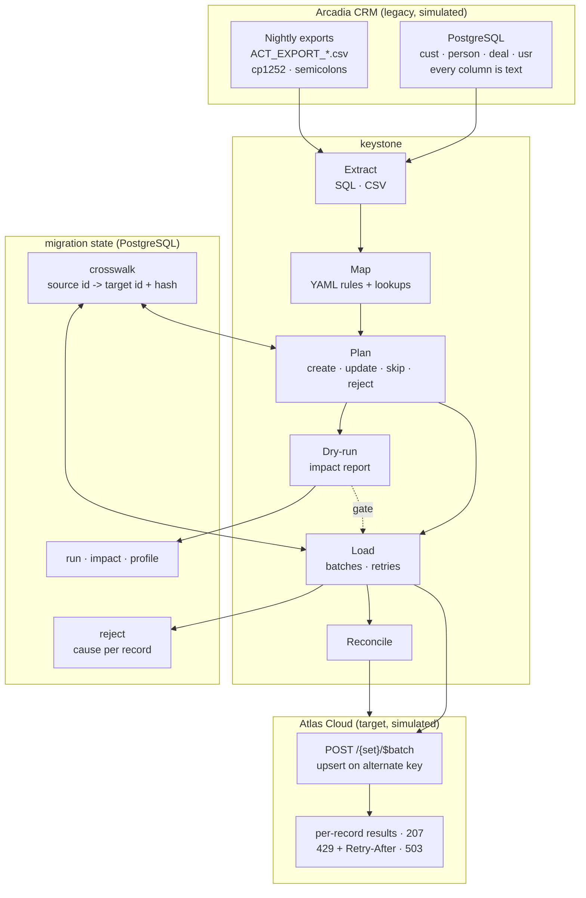
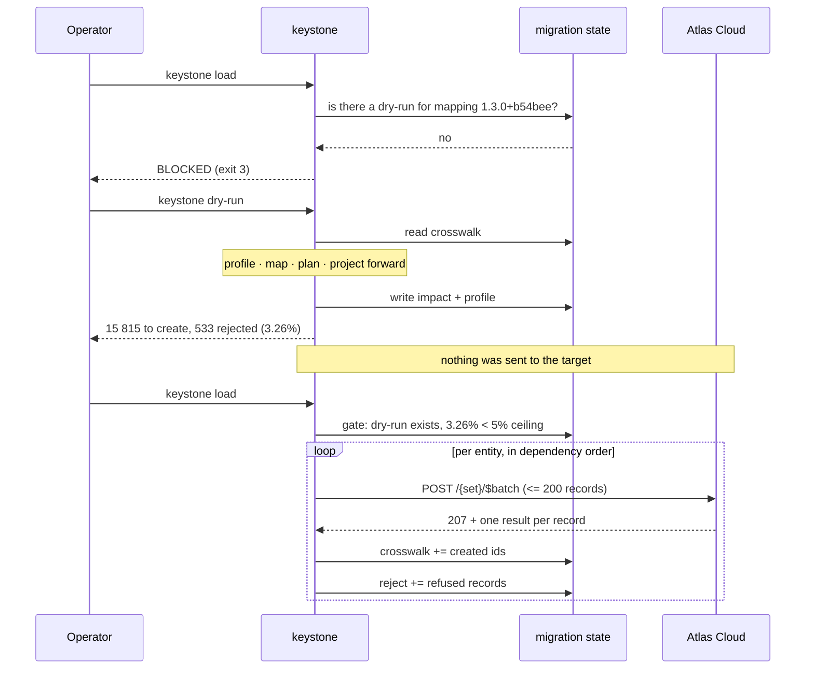

# Architecture

> Synthetic data throughout. Arcadia CRM and Atlas Cloud are both invented, and
> every record in this project is generated by the code in this repository.

## Overview

## The five stages

| Stage | Module | Responsibility | Failure mode |
| --- | --- | --- | --- |
| Extract | `extract/` | Read SQL rows or CSV rows, apply the source filter | `DatabaseError` / `MappingError` → run fails |
| Map | `mapping/` | Transform, look up, resolve references | `RecordRejected` → parked, run continues |
| Plan | `load/planner.py` | Decide create / update / skip against the crosswalk | — |
| Load | `load/` | Batch, send, read the result array, remember | `RetryBudgetExhausted` → run fails |
| Reconcile | `reconcile/` | Compare source, crosswalk and target | mismatch → run is `PARTIAL` |

The stage boundary that matters is between **map** and **load**. Everything up
to and including planning is pure: same inputs, same outputs, no side effects,
no network. That is what makes the dry-run trustworthy -- it is not a special
mode, it is the same code with the last stage not called.

## Why the dry-run is the centre of the design

Three properties of that diagram are the whole point.

**The gate reads the database, not the operator.** "We ran a dry-run" is a
claim; a row in `migration.impact` carrying the same mapping fingerprint is
evidence. Editing a mapping file after its dry-run changes the fingerprint and
closes the gate again, automatically.

**The crosswalk is written per batch, not at the end.** A run killed halfway
leaves a crosswalk that is correct for what was actually written, so the next
run continues instead of duplicating. This was demonstrated accidentally
during development: a crash after the accounts were loaded left the migration
resumable, and the next run skipped them.

**Rejections do not stop the run.** One malformed record out of sixteen
thousand blocks nothing; it is parked with the field and the rule that refused
it, and the run continues. The alternative -- fail the batch -- means the
migration stops at 3 a.m. on the first bad row, and is switched off within a
week.

## The four data stores

| Store | Contents | Rebuildable from |
| --- | --- | --- |
| `legacy.*` | The source system, read-only | Nothing -- it is somebody else's system |
| `migration.crosswalk` | source id → target id + content hash | **Nothing.** Losing it means the next run duplicates every record |
| `migration.reject` | What did not migrate, and why | Re-derivable by re-running, but the attempt history is not |
| `migration.run` / `impact` / `profile` | What was attempted and what was predicted | Nothing |
| Atlas Cloud | The result | `legacy` + the mappings, if the crosswalk is intact |

That table decides what gets backed up. `crosswalk` is the one row of it that
would turn a bad afternoon into a new project.

## Why the target is a separate service

A migration demonstrated against a function call never exercises the parts that
break in production: a batch size limit lower than anyone guessed, a 429 that
expects to be obeyed, a partial failure inside an otherwise good batch, an API
key, referential integrity enforced on the other side, and a connection that
drops during entity three of four.

So Atlas Cloud is a FastAPI service that keystone talks to over HTTP with no
privileged access. In CI its fault injection stays **on**: a retry policy that
has never retried anything is a retry policy nobody has tested.

## Performance

Measured on the default configuration (1 200 companies, 4 000 contacts,
2 600 opportunities, 9 000 activities) against PostgreSQL 16 and the target
running on the same machine.

| Step | Duration |
| --- | --- |
| Generate the simulated Arcadia CRM (16 903 rows + 3 export files) | ~1.0 s |
| Dry-run: profile, map and plan 16 348 records | ~1.7 s |
| Load: 15 815 records in 81 batches, **no faults injected** | **~2.1 s** |
| Load: the same, with the target's default fault injection on | **9-16 s** |
| Second load (nothing changed) | **~1.0 s**, zero writes |
| Reconcile | ~0.3 s |

The gap between those two load figures is the whole point of measuring it.
Without faults the migration moves about **7 500 records per second** through
HTTP, and the bottleneck is the target's batch limit of 250. With the default
injection -- 5% of batches answered 503, 6% rate-limited with a `Retry-After`
of one to three seconds -- the same work takes four to eight times longer, and
almost all of the difference is the client **waiting because it was told to**.

That is the correct behaviour and it is worth seeing in a number: a client that
ignored `Retry-After` would look faster in this table and would be throttled or
blocked by a real API within a day.

Storage: `legacy` 3.5 MB, `migration` 6.2 MB. The migration's own state is
larger than the data it migrated, which is the correct shape: a crosswalk row
carries two identifiers and a hash for every record that ever moved.

Raising the batch limit is a one-line configuration change, which is the point
of it being configuration rather than a constant.

## Why these choices

**PostgreSQL for both the legacy system and the migration state.** The legacy
schema needs to be ugly and relational; the migration state needs transactions,
`ON CONFLICT`, JSONB for reject payloads and array parameters. One engine does
both, and the two schemas are separated so nothing can confuse them.

**YAML for the mappings, not Python.** See [mapping.md](mapping.md). The short
version: a mapping is a business document that happens to be executable, and
`git diff` on it has to be readable by the person who owns the data.

**A closed registry of transforms.** A mapping names a function; it cannot
define one. That is the security boundary of the declarative layer, and it is
why these files can be edited by someone who must not be able to execute code.

**The content hash over the mapped payload, not the source row.** Cosmetic
changes in the source -- whitespace, a date re-typed in another format, a
country spelled differently -- produce the same target payload and therefore no
write at all. A re-run touches only what genuinely changed.

See [decisions.md](decisions.md) for the full set of trade-offs, each with the
condition that would make it the wrong choice, and [security.md](security.md)
for the security posture and what it does not cover.
